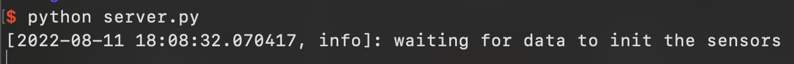
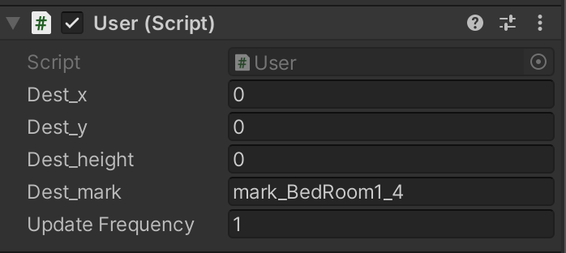
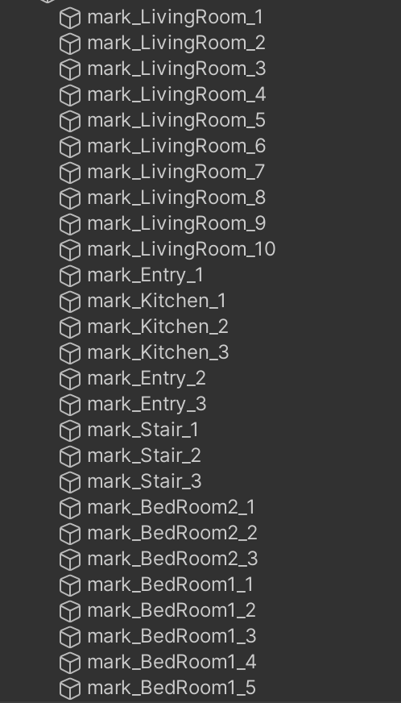
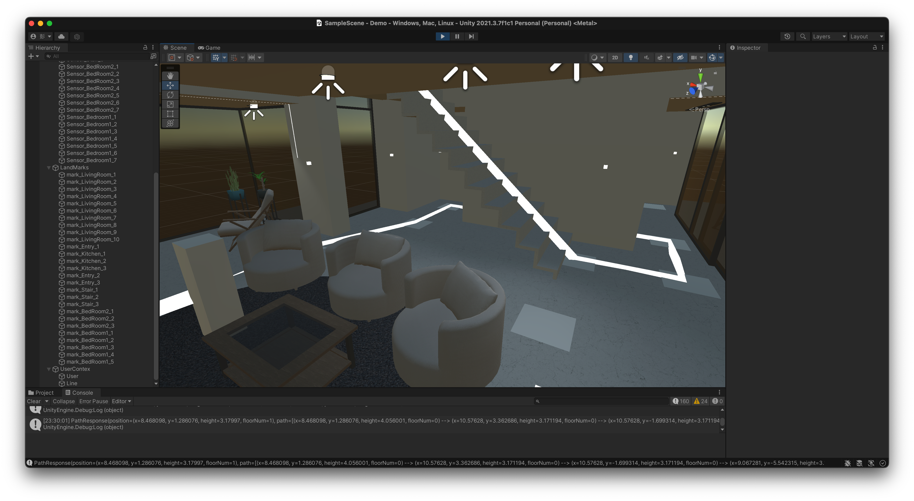

# Cloud & IoT Technology Based Indoor Navigation Solution with intuitive AR Guidance

## Contributors
**Haobo Peng**: 
* The Demo Codes
* Solution Implementation part of the report 

**Peter (Xuhang Cao)**
* add here ...

**Gawain (Xuyuan Liu)**
* Provide the building model for the Demo 
* Potential Improvement & Implementation of Technology analysis of Final Paper

**Elaine (Mingyue Ding)**
* Introduction & related work parts of the final paper

## Description

## How to use
The whole [Demo](./Demo/) folder is a complete Unity project. So please directly open this folder with Unity and you should be able to see a house in the scene. 

Then go to the [server](./Demo/Assets/_MyScripts/server/) folder and type in `python server.py` or `python3 server.py` to start the server locally. Make sure `Scipy` module is installed in your python environment. If you see a message "waiting for data to init the sensors", the server is started successfully and waiting for client to connect. 

Now get back to the Unity project window and click on the `/UserContex/User` object in the Hierachy window. Then in the inspector there should be a component look like this: 
This is the place to set the destination of the user. There are 2 ways to do that: 
1. Directly set the coordinate with `Dest_x`, `Dest_y` and `Dest_height` fields and leave the `Dest_mark` empty
2. set the `Dest_mark` with some pre-defined name of key points. If this field is set, the system will ignore the `Dest_x`, `Dest_y` and `Dest_height` fields. However, if the input for `Dest_mark` is not valid, it will again to use the coordinate as the destination. The possible `Dest_mark` values are: 

Finally the `Update Frequence` field is for setting how often the path will be updated (times per second). If your computer is not able to handle a high update frequency, set a lower value. 

Once everything are properly set, directly run the scene with the run button at the top. The server side and the console of unity will both have some logs shown. Sometimes the system may crash with message "Acknowledgement time out" in the console of Unity. In this case just try to repeat the whole process again, it should work :)

After the Demo started, a white line should be generated showing the path to the destination: 
The tall cube in the scene is the "user", while the Demo is running, you can move it somewhere else to see how the path change. 

To stop the Demo, simply click the run button at the top again. Note that if there is something wrong, the system may quit and show some error message in the Unity console or the server console. Check them if necessary. 

## Reference
